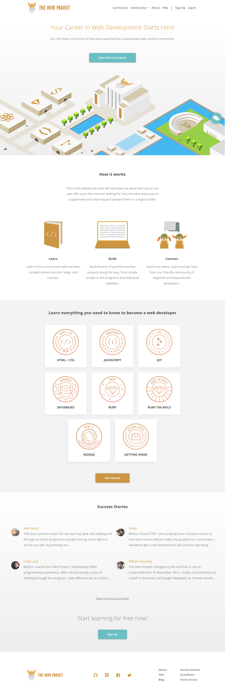
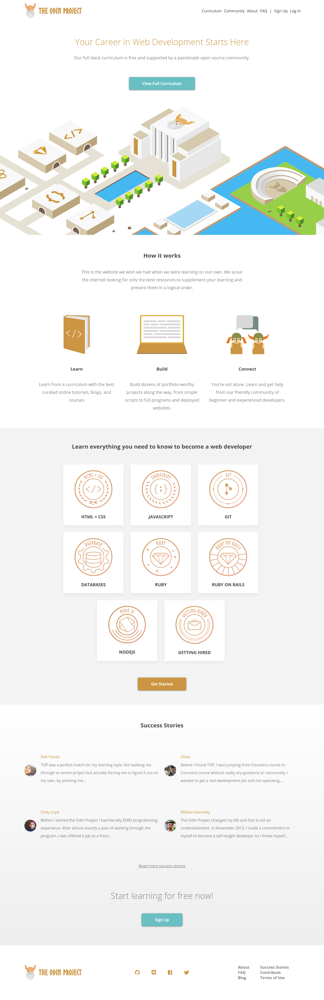

# Project: Design Your Own Grid-Based Framework

This is the final project of the HTML & CSS of the Microverse curriculum. We have to use everything we have learned until now to build our own simple grid-based framework and then use it to clone any website, in this case The Odin Project front page.

For more information about the project visit [The Odin Project](https://www.theodinproject.com/)

- Original web page

- Our solution

## Built With

- HTML & CSS

## Live Demo

[Live Demo Link](https://raw.githack.com/jubaan/Project--Design-Your-Own-Grid/grid-based-framework/index.html)

## Authors

👤 **Julio Añoveros**

- Github: [@jubaan](https://github.com/jubaan)
- Twitter: [@AnoverosJulio](https://twitter.com/AnoverosJulio)
- Linkedin: [linkedin](https://www.linkedin.com/in/julio-a%C3%B1overos-b987a8a/)

👤 **Clinton Enyinna**

- Github: [@ClintonEnyinna](https://github.com/ClintonEnyinna)
- Twitter: [@ClintonEnyinna](https://twitter.com/ClintonEnyinna)
- Linkedin: [linkedin](https://linkedin.com/in/clinton-enyinna-a72031125)

## 🤝 Contributing

Contributions, issues and feature requests are welcome!

Feel free to check the [issues page](issues/).

## Show your support

Give a ⭐️ if you like this project!

## 📝 License

This project is [MIT](lic.url) licensed.
